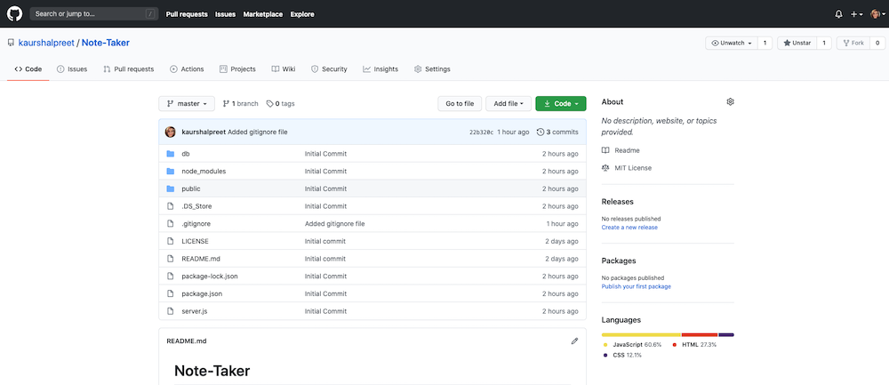

# Note-Taker

  

  ## Description
  This application is designed for users that need to keep track of a lot of information, it's easy to forget or be unable to recall something important. Being able to take persistent notes allows users to have written information available when needed. 
  Note-Taker is an application that can be used to write, save, and delete notes. This application will use an express backend and save and retrieve note data from a JSON file.  
  
  [The Link to My Github Repository](https://github.com/kaurshalpreet/Note-Taker)

   

---

  ## Table of Contents
  1. [Installation](#Installation)
  1. [Usage](#Usage)
  1. [Credits](#Credits)
  1. [License](#License)
---

  ## Installation
 
  npm i   

---

  ## Usage

 This Application allow users to create and save notes, view previously saved notes and delete previously saved notes.

 This app is deployed on [Heroku](https://boiling-retreat-00201.herokuapp.com/)

 You can also find a walkthrough video that demonstrates the functionality of the application [here](https://drive.google.com/file/d/1aXjQOlONFZSRmzvhUkDhorZMfkvLLo2l/view)

---

## Credits

* UC Davis BootCamp - Instructors and TAs
* https://www.w3schools.com/
* https://www.youtube.com/
* https://www.google.com/
* https://dashboard.heroku.com/apps
* https://choosealicense.com/licenses/
* https://shields.io/category/license

---

  ## License
  #### This application is licensed under the [MIT License](https://opensource.org/licenses/MIT)
  
---

  ## Collaborators
  If you want to contribute or collaborate for the project, you can simply enter your input [here](https://github.com/kaurshalpreet/Note-Taker/issues)

  
---

  ## Questions
  #### You can reach me via my [Github](https://github.com/kaurshalpreet) account. 
  #### Email me with any additional questions at: kaurshalpreet@gmail.com  
 